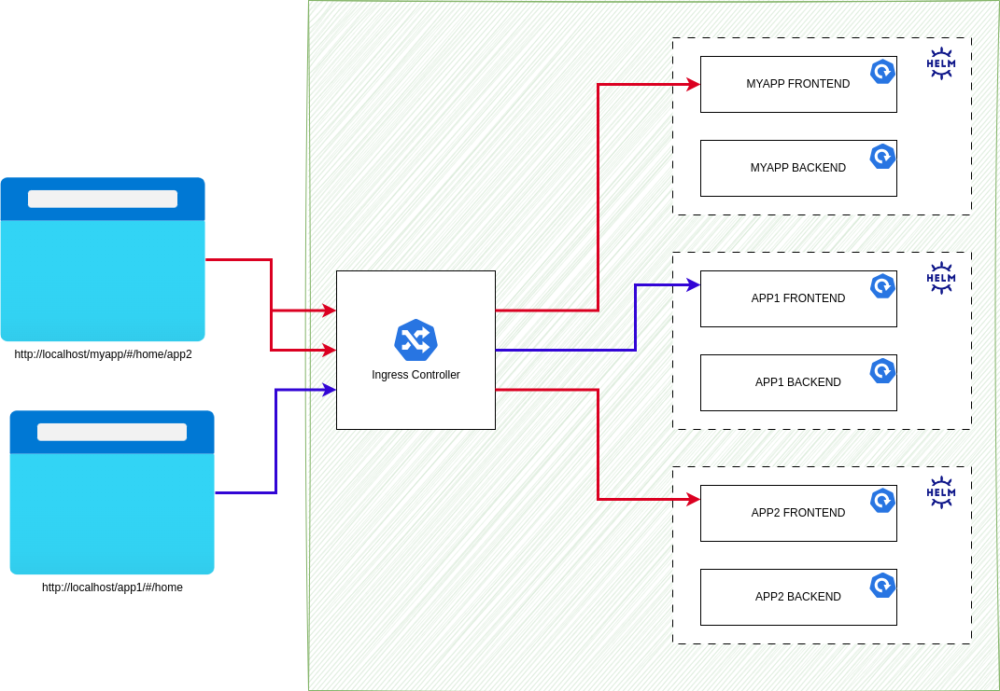

= Example Project to Demo Microfront end.

:source-highlighter: coderay

== Possible Deployment mode in K8S.

== How to run

- clone the project.
- Bring up application.
+
----
docker compose up -d
----
NOTE: Dynamic loading works only with docker daemon as service discovery is written for docker runtime.

- Alternatively you can run `pnpm install` and start application using `ng serve`, `ng serve --port 4201` and `ng serve --port 4202` for myapp, app1 and app2 respectively.
- Browse to `http://localhost/myapp`, on menu bar click on `app1` and `app2`, dynamically load `app1` and `app2` modules.

== Step by step, How to enable Angular Module Federation.

=== Initialize

- Create 3 projects.
+
[,console]
----
$ ng new myapp --routing --prefix k
$ ng new app1 --routing --prefix k1
$ ng new app2 --routing --prefix k2
----

- Install `@angular/material` on each apps on all projects.
+
[,console]
----
ng add @angular/material
----

- Install `@angular/pwa` on each apps on all projects.
+
[,console]
----
ng add @angular/pwa
----
- Install `@angular-eslint/schematics` on all apps.
+
[,console]
----
ng add @angular-eslint/schematics
----
- Add `@angular/flex-layout` on all apps
+
[,console]
----
pnpm install @angular/flex-layout
----

- Generate home module on all apps.
+
[,console]
----
ng g m home --routing
----
- Generate home module on each apps.
+
[,console]
----
ng g c home -m home
----
- Remove `app.component.html`, `app.component.scss` from each apps and replace `templateUrl` and `styleUrl` with as below.
+
[source,typescript]
----
- templateUrl: './app.component.html',
- styleUrl: './app.component.scss'
+ template: `<router-outlet></router-outlet>`
----

- In `apps.routes.ts` add routing information as shown below.
+
[source,typescript]
----
import { Routes } from '@angular/router';

export const routes: Routes = [
  {
    path: 'home',
    pathMatch: 'prefix',
    loadChildren: () => import('./home/home.module').then(m => m.HomeModule)
  },
  {
    path: '',
    pathMatch: 'full',
    redirectTo: 'home'
  }
];

----

- In `home-routing.module.ts` of each ms add following.
+
[source,typescript]
----
import { RouterModule, Routes } from '@angular/router';
import { NgModule } from '@angular/core';

import { HomeComponent } from './home.component';

const routes: Routes = [
  {
    path: '',
    component: HomeComponent
  }
];

@NgModule({
  imports: [RouterModule.forChild(routes)],
  exports: [RouterModule]
})
export class HomeRoutingModule {}

----
- Add additional meterial related modules to `home.module.ts` on each apps.
+
[source,typescript]
----
import { CommonModule } from '@angular/common';
import { FlexLayoutModule } from '@angular/flex-layout';
import { MatRippleModule } from '@angular/material/core';
import { MatToolbarModule } from '@angular/material/toolbar';
import { NgModule } from '@angular/core';

import { HomeComponent } from './home.component';
import { HomeRoutingModule } from './home-routing.module';

@NgModule({
  declarations: [HomeComponent],
  imports: [CommonModule, FlexLayoutModule, MatToolbarModule, MatRippleModule, HomeRoutingModule]
})
export class HomeModule {}

----

- Update `home.component.html` page to have header, footer and router outlet. change the header name to `MYAPP`, `APP1` and `APP2` for respective apps.
+
[source,html]
----

  

    <mat-toolbar color="primary">
      APP1
    </mat-toolbar>
  

  

    
<router-outlet></router-outlet>

  

  

    <mat-toolbar color="primary">
      

        Allrights Reserved &#64; KP 2023
      

    </mat-toolbar>
  

----
- Remove `standalone: true` and `imports` from `home.component.ts`

- Update `styles.scss` with following configuration for flexbox to work.
+
[source,css]
----
html,
body {
  height: 100%;
  box-sizing: border-box;
  margin: 0;
  font-family: Roboto, 'Helvetica Neue', sans-serif;
}
----
- In `app1`, perform following tasks.
.. Add `app1` module.
+
[source,shell]
----
ng g m app1 --routing
----
.. Add `app1` component.
+
[source,shell]
----
ng g c app1 -m app1
----
.. Update `home-routing.module.ts`. as shown below.
+
[source,typescript]
----
import { RouterModule, Routes } from '@angular/router';
import { NgModule } from '@angular/core';

import { HomeComponent } from './home.component';

const routes: Routes = [
  {
    path: '',
    component: HomeComponent,
    children: [
      {
        path: '',
        loadChildren: () => import('../app1/app1.module').then(m => m.App1Module)
      }
    ]
  }
];

@NgModule({
  imports: [RouterModule.forChild(routes)],
  exports: [RouterModule]
})
export class HomeRoutingModule {}

----

.. Change `app1-routing.module.ts` as shown below.
+
[source,typescript]
----
import { RouterModule, Routes } from '@angular/router';
import { App1Component } from './app1.component';
import { NgModule } from '@angular/core';

const routes: Routes = [
  {
    path: '',
    component: App1Component
  }
];

@NgModule({
  imports: [RouterModule.forChild(routes)],
  exports: [RouterModule]
})
export class App1RoutingModule {}

----
.. Update `app1.component.html` as shown below.
+
[source,html]
----

  
<b style="font-size: large">app1 works!</b>

----
.. Remove `standalone: true` and `imports` from `app1.component.ts`
.. Update `app1.module.ts` as shown below.
+
[source,typescript]
----
import { CommonModule } from '@angular/common';
import { FlexLayoutModule } from '@angular/flex-layout';
import { NgModule } from '@angular/core';

import { App1Component } from './app1.component';
import { App1RoutingModule } from './app1-routing.module';

@NgModule({
  exports: [App1Component],
  declarations: [App1Component],
  imports: [CommonModule, FlexLayoutModule, App1RoutingModule]
})
export class App1Module {}
----
- Repeat the last step for `app2` application as well.
.. Add `app2` module.
+
[,console]
----
ng g m app2 --routing
----
.. Add `app2` component.
+
[,console]
----
ng g c app2 -m app2
----
.. Update `home-routing.module.ts`. as shown below.
+
[source,typescript]
----
import { RouterModule, Routes } from '@angular/router';
import { NgModule } from '@angular/core';

import { HomeComponent } from './home.component';

const routes: Routes = [
  {
    path: '',
    component: HomeComponent,
    children: [
      {
        path: '',
        loadChildren: () => import('../app2/app2.module').then(m => m.App2Module)
      }
    ]
  }
];

@NgModule({
  imports: [RouterModule.forChild(routes)],
  exports: [RouterModule]
})
export class HomeRoutingModule {}

----

.. Change `app2-routing.module.ts` as shown below.
+
[source,typescript]
----
import { RouterModule, Routes } from '@angular/router';
import { App2Component } from './app2.component';
import { NgModule } from '@angular/core';

const routes: Routes = [
  {
    path: '',
    component: App2Component
  }
];

@NgModule({
  imports: [RouterModule.forChild(routes)],
  exports: [RouterModule]
})
export class App2RoutingModule {}

----
.. Update `app2.component.html` as shown below.
+
[source,html]
----

  
<b style="font-size: large">app2 works!</b>

----
.. Remove `standalone: true` and `imports` from `app2.component.ts`
.. Update `app2.module.ts` as shown below.
+
[source, typescript]
----
import { CommonModule } from '@angular/common';
import { FlexLayoutModule } from '@angular/flex-layout';
import { NgModule } from '@angular/core';

import { App2Component } from './app2.component';
import { App2RoutingModule } from './app2-routing.module';

@NgModule({
  exports: [App2Component],
  declarations: [App2Component],
  imports: [CommonModule, FlexLayoutModule, App2RoutingModule]
})
export class App2Module {}

----
- Now start each app using below command and access from browser and verify all apps are working.
+
[source,shell]
----
// myapp
ng serve
// app1
ng serve --port 4201
// app2
ng serve --port 4202
----

- Verification.
.. Verify `app1` is working by browsing `http://localhost:4201`
.. Verify `app2` is working by browsing `http://localhost:4202`

- Stop the apps.

### Enable federation.

#### Enable Module Export for App1.
- Enable remote app for `app1`.
+
[source,shell]
----
ng add @angular-architects/module-federation --type remote
----
- Update `webpack.config.js` to expose App1Module and shared libraries.
+
[source,typescript]
----
const { shareAll, share, withModuleFederationPlugin } = require('@angular-architects/module-federation/webpack');

module.exports = withModuleFederationPlugin({
  name: 'app1',

  exposes: {
    './App1Module': './src/app/app1/app1.module.ts'
  },

  // shared: {
  //   ...shareAll({ singleton: true, strictVersion: true, requiredVersion: 'auto' }),
  // },
  shared: share({
    '@angular/core': { singleton: true, strictVersion: true, requiredVersion: 'auto' },
    '@angular/common': { singleton: true, strictVersion: true, requiredVersion: 'auto' },
    '@angular/common/http': { singleton: true, strictVersion: true, requiredVersion: 'auto' },
    '@angular/router': { singleton: true, strictVersion: true, requiredVersion: 'auto' },
    '@angular/material': { singleton: true, strictVersion: true, requiredVersion: 'auto', includeSecondaries: true },
  })
});

----

#### Enable Module Export for App2.

- Enable remote app for `app2`.
+
[source,shell]
----
ng add @angular-architects/module-federation --type remote
----
- Update `webpack.config.js` to expose App2Module and shared libraries.
+
[source,typescript]
----
const { shareAll, share, withModuleFederationPlugin } = require('@angular-architects/module-federation/webpack');

module.exports = withModuleFederationPlugin({
  name: 'app2',

  exposes: {
    './App2Module': './src/app/app2/app2.module.ts'
  },

  // shared: {
  //   ...shareAll({ singleton: true, strictVersion: true, requiredVersion: 'auto' }),
  // },
  shared: share({
    '@angular/core': { singleton: true, strictVersion: true, requiredVersion: 'auto' },
    '@angular/common': { singleton: true, strictVersion: true, requiredVersion: 'auto' },
    '@angular/common/http': { singleton: true, strictVersion: true, requiredVersion: 'auto' },
    '@angular/router': { singleton: true, strictVersion: true, requiredVersion: 'auto' },
    '@angular/material': { singleton: true, strictVersion: true, requiredVersion: 'auto', includeSecondaries: true },
  })
});

----

#### Import Modules on myapp.

.- Consume the remote app in `myapp` using dynamic loading.
+
[source,shell]
----
$ ng add @angular-architects/module-federation --type dynamic-host
----
- Update `webpack.config.js` to expose App2Module and shared libraries.
+
[source,typescript]
----
const { shareAll, share, withModuleFederationPlugin } = require('@angular-architects/module-federation/webpack');

module.exports = withModuleFederationPlugin({

  // shared: {
  //   ...shareAll({ singleton: true, strictVersion: true, requiredVersion: 'auto' }),
  // },
  shared: share({
    '@angular/core': { singleton: true, strictVersion: true, requiredVersion: 'auto' },
    '@angular/common': { singleton: true, strictVersion: true, requiredVersion: 'auto' },
    '@angular/common/http': { singleton: true, strictVersion: true, requiredVersion: 'auto' },
    '@angular/router': { singleton: true, strictVersion: true, requiredVersion: 'auto' },
    '@angular/material': { singleton: true, strictVersion: true, requiredVersion: 'auto', includeSecondaries: true },
  })
});

----
- Update `home-routing.module.ts` to use `app1` and `app2 modules`.
+
[source,typescript]
----
const routes: Routes = [
  {
    path: '',
    component: HomeComponent,
    children: [
      {
        path: 'app1',
        loadChildren: () =>
          loadRemoteModule({
            type: 'manifest',
            remoteName: 'app1',
            exposedModule: './App1Module',
          }).then((m) => m.App1Module),
      },
      {
        path: 'app2',
        loadChildren: () =>
          loadRemoteModule({
            type: 'manifest',
            remoteName: 'app2',
            exposedModule: './App2Module',
          }).then((m) => m.App2Module),
      },
    ],
  },
];
----
. Update `mf.manifest.json` to point to the remote apps.
+
[source, json]
----
{
  "app1": "http://localhost:4201/remoteEntry.js",
  "app2": "http://localhost:4202/remoteEntry.js"
}
----

- Now Run the apps.
+
[source,shell]
----
# MYAPP
ng serve
# App1
ng serve --port 4201
# App2
ng serve --port 4202
----

- Verification.
.. Verify `app1` is working by browsing `http://localhost:4201`
.. Verify `app2` is working by browsing `http://localhost:4202`
.. Verify `myapp` is working by browsing `http://localhost:4200`
.. Verify `app1` module is getting loaded by brouwing `http://localhost:4200/#/home/app1`
.. Verify `app2` module is getting loaded by brouwing `http://localhost:4200/#/home/app2`

Referances:

- https://www.angulararchitects.io/en/blog/whats-new-in-angular-architects-module-federation-14-3/